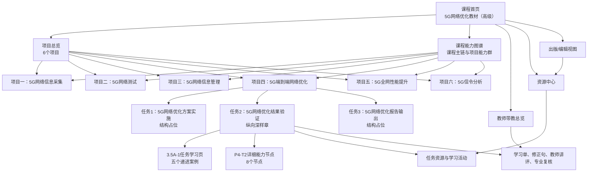
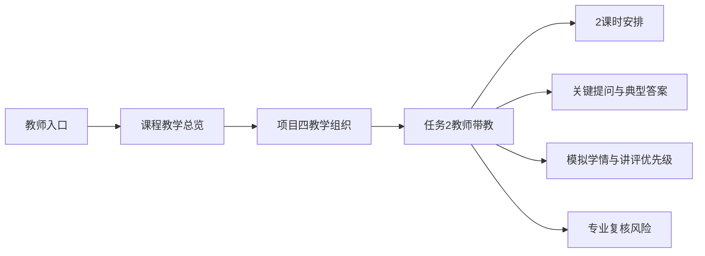
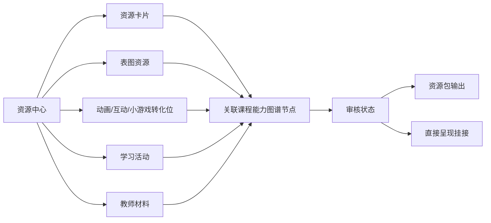
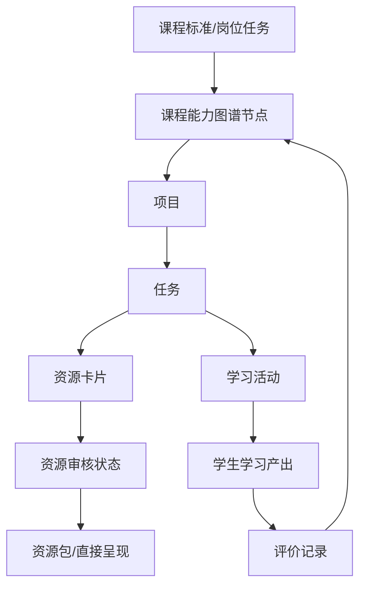

# 数字教材整书层级与流转关系图

生成日期：2026-06-23  
适用阶段：数字教材整体原型制作前置设计  
当前深样章：`samples/task_workbench_3_5a1_two_period_sample/`

## 1. 目的

本文件用于说明《5G网络优化教材（高级）》数字教材整体原型应如何组织课程层、项目层、任务层、课程能力图谱、资源中心、教师带教和出版/编辑视图。

当前目标不是把18个任务全部做成高质量样章，而是先验证整本数字教材是否能形成清晰的层级和流转。项目四任务2的3.5A-1样章作为纵向深样章，其他任务先作为结构占位。

## 2. 基本层级

全书已识别为6个项目、18个任务：

| 层级 | 数量 | 当前原型处理 |
| --- | ---: | --- |
| 课程 | 1 | 做课程首页、课程能力图谱入口、当前学习建议和多角色入口 |
| 项目 | 6 | 做项目总览、任务链、能力群和开发状态 |
| 任务 | 18 | P4-T2使用3.5A-1深样章；其余任务做结构占位 |
| 课程能力图谱 | 7个课程主链节点 + P4-T2 8个详细节点 | 作为暗线数据骨架贯穿课程、项目、任务、资源和评价 |
| 资源单元 | 卡片、表图、动画/互动/小游戏转化位、学习单、教师材料 | 先展示资源类型、映射关系和审核状态，不批量制作正式资源 |
| 质量门禁 | QA、专业复核、媒体审查、一线试看、平台挂接 | 明确完成/未完成状态，不把占位写成已完成 |

## 3. 整体信息架构

## 4. 三条主路径

### 4.1 学生学习路径

学生路径的判断标准：

1. 学生首次进入能知道当前先学什么；
2. 项目页能说明任务之间的先后关系；
3. 任务页能承接3.5A-1深样章；
4. 学生完成任务后，能看到自己对应哪些能力点已经完成、哪些还需补强；
5. 学生端不暴露后台字段，如资源ID、证据项编号、审核状态码。

### 4.2 教师带教路径

教师路径的判断标准：

1. 教师能看到课程、项目和任务的教学组织关系；
2. 教师能直接使用2课时安排、提问脚本、典型答案和讲评建议；
3. 教师能区分真实学生数据和模拟学情；
4. 教师能看到专业复核风险，避免把教学模拟案例当成已审核行业事实。

### 4.3 资源出版路径

出版/编辑路径的判断标准：

1. 资源不是孤立文件，必须能追溯到项目、任务和能力节点；
2. 每个资源要有类型、用途、适用位置和审核状态；
3. 原教材媒体不能默认可用，必须保留媒体治理状态；
4. 资源输出和直接呈现输出要分开表达；
5. 真实出版社平台接口暂不接入，只在原型中展示挂接位置。

## 5. 课程能力图谱的暗线作用

课程能力图谱不是一个单独的炫技页面，而是贯穿全书的组织关系。

在整体原型中，图谱至少承担四个作用：

1. 课程层：显示学生正在学习整门课的哪一段工作过程；
2. 项目层：显示项目对应的能力群，而不是只列目录；
3. 任务层：显示当前任务训练的具体能力节点；
4. 资源层：显示卡片、活动、评价和审核状态如何挂接到节点。

## 6. 整体原型页面清单

| 页面 | 主要读者 | 必须回答的问题 | 处理深度 |
| --- | --- | --- | --- |
| 课程首页 | 学生、教师 | 这门课怎么学，从哪里开始 | 中等保真 |
| 项目总览页 | 学生、教师 | 六个项目之间如何推进，当前项目在哪里 | 中等保真 |
| 项目四详情页 | 学生、教师 | 项目四三个任务如何衔接 | 中等保真 |
| 任务2学习页 | 学生 | 怎样完成结果验证任务 | 复用/链接3.5A-1深样章 |
| 课程能力图谱页 | 学生、教师、编辑 | 图谱如何连接项目、任务、资源和评价 | 中等保真 |
| 教师带教页 | 教师 | 如何组织项目四任务2的2课时课堂 | 复用3.5A-1教师材料 |
| 资源中心页 | 编辑、教师 | 哪些资源已生成，哪些只是转化位 | 中等保真 |
| 出版/编辑视图 | 出版社、项目团队 | 资源包输出和直接挂接状态如何看 | 低到中等保真 |

## 7. 3.5A-1嵌入方式

整体原型中不复制3.5A-1全部代码。建议先采用链接或内嵌入口：

1. 在项目四任务2卡片上标注“已形成深样章”；
2. 点击进入 `samples/task_workbench_3_5a1_two_period_sample/index.html`；
3. 在课程能力图谱中标出P4-T2的8个详细节点；
4. 在资源中心中展示P4-T2已具备的案例、活动、学习单、教师材料和复核表；
5. 返回整体原型后，任务2状态显示为“深样章完成，真实试看和专业复核未完成”。

## 8. 当前质量门禁

整体原型进入评审前，至少应满足：

1. 能从课程首页进入项目页；
2. 能从项目页进入项目四任务2；
3. 能从项目四任务2打开或嵌入3.5A-1；
4. 能从任务页返回课程能力图谱；
5. 课程能力图谱能显示课程、项目、任务、资源、学习活动和评价记录之间的关系；
6. 学生视图、教师视图、资源/出版视图边界清楚；
7. 其他任务明确标注为结构占位；
8. 不把未制作任务伪装成完整内容；
9. 浏览器QA覆盖桌面端和移动端，无横向溢出、无控制台错误；
10. 治理文件和成果索引同步更新。

## 9. 下一步实现建议

1. 以 `reports/课程能力图谱跨层映射表.csv` 作为整体原型的数据蓝本；
2. 新建 `samples/digital_textbook_overall_prototype/`；
3. 先做静态数据文件，包含课程、项目、任务、图谱、资源、角色视图状态；
4. 再做课程首页、项目页、图谱页、资源中心页和出版/编辑视图；
5. 将3.5A-1作为任务2深样章入口接入；
6. 完成桌面端和移动端QA；
7. 更新治理层。
