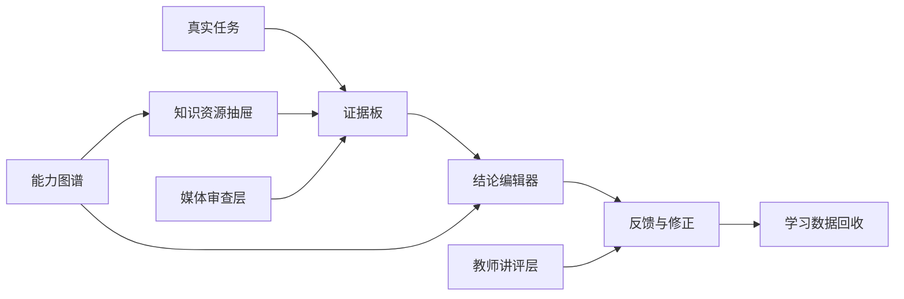
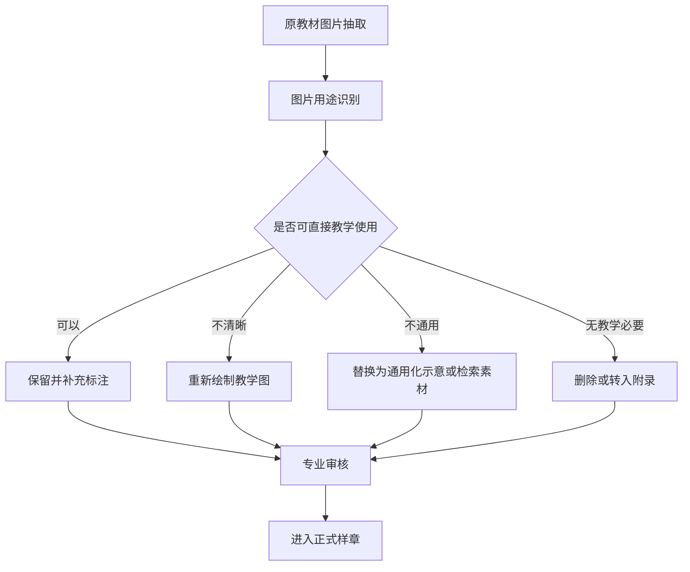

# 样章3.0信息架构与页面草图说明

生成日期：2026-06-22  
样章对象：项目四 / 任务2：5G网络优化结果验证  
适用阶段：端到端生产演练的下一轮原型设计，不是正式出版稿

## 0. 结论先行

样章2.0解决了部分结构错误，例如教师卡误入学生学习路径、右侧“学习证据”概念不清、媒体资源未审查等问题，但没有解决更核心的问题：学生看到的仍然接近“线性卡片翻页”，而不是一个可以完成真实学习任务的数字教材单元。

因此，样章3.0不应继续沿着“把每张卡做得更好看”的方向修补。更合理的调整是：

1. 卡片仍然是最小资源单元，但不再等同于页面；
2. 页面主形态从“卡片播放器”改为“任务工作台”；
3. 学生进入页面后，首先面对真实任务、证据材料和结论产出，而不是一张张翻页；
4. 教师支持、媒体审查、自学支持、能力图谱映射都应成为工作台背后的层，而不是混在学生学习流中；
5. 原教材中的非通用仿真软件截图不能用占位符“解决”，必须进入媒体治理流程：保留并标注、检索替换、重新绘制、删除，四选一。

一句话概括：3.0的目标不是做一个更漂亮的卡片页面，而是做一个学生能完成任务、教师能组织教学、出版社能识别教材性的数字教材样章。

## 1. 当前问题的客观判断

### 1.1 占位符不是解决方案

把仿真软件截图替换成占位符，只能说明“这张图现在不能直接使用”，不能提升学习质量。占位符本身没有教学价值，也不能帮助学生理解覆盖、切换、时延、速率、容量、掉线之间的证据关系。

占位符的合理用途只有两个：

1. 在样章制作阶段防止未经审查的图片被误认为正式资源；
2. 标记该位置需要后续重绘、替换或补充标注。

如果最终样章仍以占位符呈现给教师和学生，效果会低于原教材，因为它减少了信息量，却没有补足解释、任务和判断路径。

### 1.2 自学模式不能是统一附注

样章2.0中的自学模式补充过于模板化，本质上只是给每张卡附加同一句学习建议。它不能真正支持学生自学。

有效的自学模式应该改变学习支持的密度和形态，而不是增加一段通用提示。至少应包含：

1. 本卡为什么要学；
2. 读图、读表或操作时先看哪里；
3. 学生做错时的分层提示；
4. 完成任务后的解释反馈；
5. 与前后知识点的关系；
6. 必要的术语解释和补救资源。

并且这些内容必须随卡片类型变化。知识卡、证据卡、交互卡、任务卡、反馈卡不能使用同一套自学话术。

### 1.3 卡片串联不等于数字教材

卡片方式适合作为资源组织方法，但直接用卡片一页页串联，容易产生三个问题：

1. 学习节奏单一，接近幻灯片或微课脚本；
2. 学生容易只“看完页面”，没有形成证据判断和任务产出；
3. 教师难以将它作为课堂活动、讨论和评价的抓手。

因此，卡片应从“页面主角”变成“可调用资源”。学生主界面应围绕任务、证据、判断、产出组织，而不是围绕卡片顺序组织。

## 2. 3.0的设计目标

样章3.0需要同时满足三类评审对象：

1. 学生：能在没有教师逐步讲解的情况下，理解任务、查看证据、形成结论，并知道自己哪里证据不足；
2. 一线教师：能把它用于课堂讲授、任务驱动教学、实训前导入或课后自学，并能看到学生常见错误；
3. 出版社和平台方：能看出这不是网页展示或课件，而是具备内容结构、资源颗粒、能力图谱、学习证据、质量门禁的数字教材单元。

3.0的最低目标不是“所有内容都完美”，而是证明一种更合理的样章形态可以走通：

情境任务 -> 证据分析 -> 知识调用 -> 结论产出 -> 反馈修正 -> 教师讲评 -> 资源追踪。

## 3. 三种呈现路线比较

### 路线A：线性卡片教材

学生按顺序阅读卡片，从情境卡、知识卡、证据卡到任务卡和反馈卡。

优点：

1. 制作成本低；
2. 结构清晰；
3. 容易映射到资源包和出版社平台。

问题：

1. 仍然像翻页课件；
2. 学习动作不够真实；
3. 自主学习闭环弱；
4. 对“多元化和灵活性”的回应不足。

判断：不建议作为3.0主路线，只适合作为资源后台或低成本平台适配方案。

### 路线B：任务工作台

学生进入一个完整任务工作台。页面中心是任务、证据板和结论编辑器；卡片变成左侧或抽屉中的资源模块，学生按需要调用。

优点：

1. 学习目标更真实，学生不是翻页，而是在完成网优结果验证任务；
2. 证据、知识和结论之间关系更清楚；
3. 适合课堂和自学双模式；
4. 能体现能力图谱，因为每个任务动作都可以映射到能力节点；
5. 更接近“数字教材”，而不是“网页课件”。

问题：

1. 设计和实现复杂度高于线性卡片；
2. 对内容质量要求更高，必须补足证据材料、反馈规则和读图说明；
3. 需要更清晰的数据结构支撑。

判断：建议作为3.0主路线。

### 路线C：能力地图探索式教材

学生看到一张能力图谱或任务地图，自主选择节点学习，系统根据路径推荐资源和练习。

优点：

1. 形态新颖；
2. 能突出课程能力图谱；
3. 适合后续做个性化推荐和学习路径分析。

问题：

1. 对第一版样章来说风险偏高；
2. 容易变成漂亮的节点图，但学习闭环不强；
3. 若没有足够资源和测评数据支撑，图谱会显得空。

判断：可作为3.0的局部导航层，不建议作为第一屏主形态。

## 4. 推荐方案：任务工作台 + 资源卡片 + 证据链

3.0推荐采用“任务工作台”作为主页面形态。

核心原则：

1. 任务是主线：学生始终知道自己正在解决什么问题；
2. 证据是材料：所有图、表、截图、日志都要说明能证明什么、不能证明什么；
3. 卡片是资源：卡片可以是文字、音频、视频、动画、小游戏、交互题，但不直接等同于页面；
4. 图谱是纽带：每个任务动作和资源卡片都映射到能力节点；
5. 反馈是闭环：学生不是看完即结束，而是要形成结论并被反馈；
6. 教师是独立层：教师讲评、学情观察和教学组织不混入学生路径。



## 5. 信息架构

### 5.1 学生端主界面

学生端不再以“第1张卡、第2张卡”作为主感知，而是由六个区域构成：

1. 任务栏：显示角色、任务目标、完成要求、课堂/自学模式；
2. 能力路径：显示本任务涉及的能力节点和当前所在位置；
3. 证据板：集中展示覆盖、切换、性能、仿真/媒体四类证据；
4. 知识抽屉：按需打开知识卡、术语卡、动画卡、读图说明；
5. 结论编辑器：学生填写问题类型、核心证据、达标判断、后续建议；
6. 我的证据链：记录学生已经引用了哪些证据、还缺什么证据、结论是否可提交。

页面草图：

```text
+--------------------------------------------------------------------------------+
| 任务：判断校园宿舍区5G优化结果是否达标        模式：课堂 / 自学      进度状态 |
+----------------------+--------------------------------------+------------------+
| 能力路径             | 当前任务说明                         | 我的证据链       |
| 1 识别场景           | - 角色：网优助理工程师               | 已引用证据       |
| 2 问题分流           | - 问题：视频通话卡顿、直播上行时延   | 缺失证据         |
| 3 覆盖验证           |                                      | 结论状态         |
| 4 切换验证           | 证据板                               |                  |
| 5 性能验证           | [覆盖证据] [切换证据] [性能证据]     |                  |
| 6 形成结论           | [仿真/媒体证据]                      |                  |
|                      |                                      |                  |
| 资源抽屉入口         | 结论编辑器                           | 即时反馈         |
| 知识卡/动画/术语     | 问题类型、核心证据、是否达标、建议   |                  |
+----------------------+--------------------------------------+------------------+
```

### 5.2 证据板

证据板是3.0的核心，不是装饰区。每个证据单元必须回答四个问题：

1. 这是什么来源；
2. 它能支持什么判断；
3. 它不能支持什么判断；
4. 当前是否通过媒体和专业审核。

证据板建议分为四组：

| 证据组 | 内容 | 学生动作 | 风险控制 |
| --- | --- | --- | --- |
| 覆盖证据 | SS-RSRP、SS-SINR、弱覆盖、交叉覆盖 | 判断覆盖是否改善 | 阈值和单位需专家复核 |
| 切换证据 | A2/A3/A5/B类事件、SA/NSA流程 | 判断切换流程是否合理 | 不展开过深协议细节 |
| 性能证据 | 时延、速率、容量、掉线 | 判断业务体验是否达标 | 不把单一指标当最终结论 |
| 仿真/媒体证据 | 原教材仿真截图或重绘图 | 判断截图能否作为证据 | 未审查截图不得直接教学使用 |

证据单元草图：

```text
+--------------------------------------+
| 覆盖指标对比                          |
| 来源：教材表格重构 + 教学模拟数据      |
| 可证明：覆盖强度明显改善              |
| 不能证明：视频业务体验一定恢复         |
| 审核：阈值待专家复核                  |
| [加入证据链] [查看读表说明]            |
+--------------------------------------+
```

### 5.3 知识抽屉

知识抽屉不是正文堆叠区，而是学生完成任务时按需调用的资源层。

可包含：

1. 指标术语：SS-RSRP、SS-SINR、时延、速率、容量、掉线率；
2. 读图说明：怎么看覆盖图、流程图、仿真结果图；
3. 微动画：切换事件触发过程、测量-判决-执行流程；
4. 小练习：指标与证据匹配、切换流程排序；
5. 误区提示：覆盖改善不等于端到端体验达标。

知识抽屉的内容来自卡片资源，但呈现时按学习场景调用。例如学生点击“SS-SINR未达标”时，系统打开的是覆盖质量说明，而不是跳到某张固定页面。

### 5.4 结论编辑器

结论编辑器是判断样章是否像教材的关键。学生最终必须形成可检查的学习产出。

建议字段：

| 字段 | 要求 |
| --- | --- |
| 问题类型判断 | 覆盖、切换、性能、掉线、证据不足，可多选 |
| 核心证据 | 至少引用两类证据 |
| 优化前后变化 | 填写关键指标变化，不能只写“变好了” |
| 是否达标 | 达标、部分达标、未达标、无法判断 |
| 判断理由 | 80-150字，必须包含证据边界 |
| 后续建议 | 1-2条补充测试或优化建议 |

系统反馈不应只显示“正确/错误”，而应判断：

1. 是否引用了足够证据；
2. 是否把覆盖、切换、性能混为一谈；
3. 是否使用了未经审查或不能证明结论的截图；
4. 是否说明证据边界；
5. 是否提出合理后续建议。

## 6. 自学模式的重新定义

3.0中的自学模式不是开关后多一段文字，而是改变学习支持机制。

### 6.1 自学模式应增加的内容

| 模块 | 课堂模式 | 自学模式 |
| --- | --- | --- |
| 任务说明 | 简洁说明，方便教师引导 | 增加背景、角色、完成标准 |
| 证据板 | 展示证据和任务动作 | 增加读图顺序、术语解释、例子 |
| 知识抽屉 | 教师可选择讲解 | 学生可逐步展开微解释 |
| 交互练习 | 快速作答和讲评 | 提供分层提示，不直接给答案 |
| 结论编辑 | 课堂任务单 | 提供写作框架和示例片段 |
| 反馈修正 | 教师讲评为主 | 系统给出证据缺口和改进建议 |

### 6.2 自学模式的卡片级要求

不同资源卡的自学支持必须不同：

| 卡片类型 | 自学支持重点 |
| --- | --- |
| 情境卡 | 解释任务背景、角色和最终产出 |
| 知识卡 | 术语解释、最小必要知识、反例 |
| 证据卡 | 读表/读图顺序、证据边界、可引用字段 |
| 交互卡 | 分层提示、错误原因、再试一次 |
| 任务卡 | 写作模板、示例句式、提交前检查 |
| 反馈卡 | 个性化修正建议、常见误区对照 |

如果一张资源卡不能提供与其类型匹配的自学支持，就不应声称已支持自学模式。

## 7. 教师模式的边界

教师模式必须独立于学生学习路径。学生端不应出现“教师卡”，但教师端可以调用学生学习数据和资源状态。

教师模式建议包含：

1. 本任务教学目标；
2. 建议教学流程和时间分配；
3. 可开启或关闭的资源模块；
4. 学生证据链完成情况；
5. 常见错误分布；
6. 典型答案和讲评建议；
7. 媒体资源风险提示；
8. 可导出的任务单或学习记录。

教师模式不是“答案页”，而是课堂组织和学情诊断工具。

## 8. 媒体资源治理方案

### 8.1 处理流程

原教材图片进入样章前，应经历以下流程：



### 8.2 对项目四任务2图片的具体判断

| 图片 | 当前判断 | 3.0处理建议 |
| --- | --- | --- |
| image236.png | 切换流程图，图意相对明确但缺少教学标注 | 可暂用，但应重绘为三阶段流程图 |
| image245.png | SA组网切换流程，信息密度高 | 拆分为“测量-判决-执行”分步图 |
| image287.png | 仿真软件入口截图 | 不进入学生主学习界面，只作为操作说明或附录 |
| image288.png | 覆盖优化结果截图 | 重绘为覆盖结果教学面板，标注SS-RSRP/SS-SINR |
| image289.png | 切换优化结果截图 | 重绘为切换验证证据图或事件列表 |
| image290.png | 时延优化结果截图 | 改为时延指标对比表或趋势图 |
| image291.png | 速率优化结果截图 | 改为上下行速率对比表和业务体验说明 |
| image292.png | 容量优化结果截图 | 改为容量、负荷、用户数关系图 |
| image293.png | 掉线优化结果截图 | 改为掉线率、异常释放、重建立证据链图 |

客观判断：非通用仿真软件截图不是不能用，但不能“裸用”。只有在补充字段解释、读图路径、证据边界和操作目的后，才可能进入教学页面。否则，学生既不知道看哪里，也不知道这些截图能证明什么。

## 9. 卡片与能力图谱的数据模型调整

如果采用3.0路线，卡片资源的字段需要扩展。原来的“卡片ID、标题、类型、能力节点、学习动作”不够支撑工作台式呈现。

建议增加以下字段：

| 字段 | 含义 |
| --- | --- |
| resource_id | 资源唯一编号 |
| resource_type | 文本、图表、视频、动画、小游戏、交互题、任务单等 |
| capability_node | 对应能力图谱节点 |
| workspace_zone | 在工作台中出现的位置：证据板、知识抽屉、结论编辑器、反馈区等 |
| callable_context | 何时被调用，例如点击指标、证据不足、提交错误 |
| evidence_output | 学生完成后产生什么学习证据 |
| can_prove | 该资源能支持的判断 |
| cannot_prove | 该资源不能支持的判断 |
| self_study_support | 自学模式下的专属支持内容 |
| teacher_support | 教师模式下的讲评和观察建议 |
| media_status | 可用、需标注、需重绘、需替换、禁用 |
| audit_status | 待专业审核、待编辑审核、可发布 |

这意味着卡片和页面的关系变为：

```text
一个卡片资源 -> 可被多个页面区域调用
一个页面区域 -> 可组合多个卡片资源
一个能力节点 -> 可关联多个资源和多个学习证据
一个学生任务 -> 会生成一条完整证据链
```

## 10. 3.0最小可行样章范围

为了避免范围失控，建议3.0只做“项目四任务2”的一个完整任务工作台，不做整本书。

最低范围如下：

1. 一个真实任务：判断校园宿舍区5G优化结果是否达标；
2. 四类证据组：覆盖、切换、性能、仿真/媒体；
3. 六到八个核心资源模块：情境、问题分流、覆盖证据、切换证据、性能证据、媒体证据、结论任务、反馈修正；
4. 一个结论编辑器；
5. 一个我的证据链；
6. 一个知识抽屉；
7. 一个教师讲评层；
8. 一个资源追踪/审核视图。

不建议3.0立即加入的内容：

1. 大规模小游戏；
2. 完整仿真软件操作训练；
3. 个性化推荐算法；
4. 全书级学习分析；
5. 复杂三维或炫技型视觉效果。

这些内容可以后续扩展，但不应干扰第一版对“教材性”和“可学可教”的验证。

## 11. 页面草图

### 11.1 首屏

首屏必须直接呈现任务，而不是欢迎页、封面页或目录页。

```text
+-------------------------------------------------------------------------------+
| 5G网络优化结果验证                                      课堂模式 | 自学模式     |
| 角色：网络优化助理工程师                                                    |
| 任务：判断校园宿舍区优化结果是否达标，并说明证据依据和后续建议              |
+-------------------------------------------------------------------------------+
| 当前问题                                                                      |
| 普通网页访问恢复正常，但晚间视频通话偶发卡顿，直播上行时延偏高。             |
|                                                                               |
| 你不能直接判断优化成功或失败，需要先查看覆盖、切换、性能和仿真证据。          |
+-------------------------------------------------------------------------------+
| [开始问题分流] [查看证据板] [打开知识抽屉] [填写结论]                         |
+-------------------------------------------------------------------------------+
```

### 11.2 证据板页面

```text
+---------------------+---------------------+---------------------+-------------+
| 覆盖证据             | 切换证据             | 性能证据             | 仿真/媒体证据 |
| RSRP达标             | A3事件说明            | 上行时延仍偏高        | 截图未审查     |
| SINR未完全达标       | 流程需验证            | 视频业务仍异常        | 需重绘/标注    |
| [加入证据链]         | [加入证据链]          | [加入证据链]          | [查看边界]     |
+---------------------+---------------------+---------------------+-------------+
```

### 11.3 结论编辑页面

```text
+-----------------------------------------+-------------------------------------+
| 结论编辑器                               | 我的证据链                           |
| 问题类型：[覆盖][切换][性能][证据不足]   | 已引用：覆盖改善、SINR不足、时延偏高 |
| 核心证据：                               | 缺失：真实路测日志、业务保持记录      |
| 是否达标：[达标][部分达标][未达标][无法] | 状态：可提交，但需说明证据边界        |
| 判断理由：                               |                                     |
| 后续建议：                               |                                     |
| [保存草稿] [检查证据链] [提交]           |                                     |
+-----------------------------------------+-------------------------------------+
```

### 11.4 教师讲评页面

```text
+-------------------------------------------------------------------------------+
| 教师讲评：5G网络优化结果验证                                                   |
+----------------------+----------------------+----------------------+-------------+
| 完成率               | 常见错误             | 证据缺口             | 推荐讲评顺序 |
| 82%                  | 只看覆盖即下结论     | 缺少切换/性能证据    | 先证据后结论 |
+----------------------+----------------------+----------------------+-------------+
| 典型答案对比                                                                  |
| A类：证据完整但表达弱                                                         |
| B类：结论明确但证据不足                                                       |
| C类：误把仿真截图当作最终证据                                                 |
+-------------------------------------------------------------------------------+
```

## 12. 3.0验收标准

样章3.0完成后，至少应通过以下验收：

1. 首屏是任务工作台，不是卡片列表或封面；
2. 学生端没有教师卡；
3. 学生可以从任务进入证据分析、知识调用、结论填写和反馈修正；
4. 每个证据单元都说明“能证明什么”和“不能证明什么”；
5. 自学模式不是统一附注，而是针对不同模块提供不同支持；
6. 非通用仿真截图不能裸用，必须明确标注、重绘、替换或禁用；
7. 结论编辑器能生成可检查的学习产出；
8. 我的证据链能显示已引用证据、缺失证据和提交状态；
9. 教师模式独立呈现，不混入学生路径；
10. 桌面端和移动端均通过浏览器QA，无横向溢出、无空白首屏、核心交互可用。

## 13. 下一步建议

建议下一步不要立即大规模重写全部内容，而是先完成“样章3.0实施计划”，再改造原型。实施计划应明确：

1. 哪些2.0内容保留为资源；
2. 哪些内容拆入证据板、知识抽屉、结论编辑器、教师讲评层；
3. 哪些图片必须重绘或替换；
4. 自学模式每个模块分别补什么；
5. 数据结构如何从线性卡片数组改为工作台资源模型；
6. QA脚本如何验证3.0不是卡片翻页页面。

如果该方向获得认可，再进入3.0原型制作；如果不认可，应先在“任务工作台、能力地图、线性卡片”三种路线中重新选择，而不是继续局部修补。
